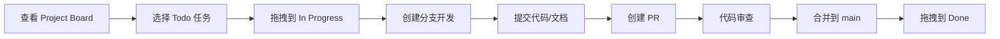

# 🤝 项目协作指南

> 魔王城下的最后村庄 - 团队协作规范

---

## 📋 项目概况

**项目名称：** 魔王城下的最后村庄
**项目类型：** 叙事驱动 RPG 游戏
**开发引擎：** Godot 4.6
**目标发布：** 2026-07-01
**当前进度：** 38%

**GitHub 仓库：** https://github.com/JCVBoss/demon_village_game
**Project Board：** https://github.com/users/JCVBoss/projects/1

---

## 👥 团队角色

### Product Owner (PO) - @JCVBoss
**职责：**
- ✅ 定义产品愿景和目标
- ✅ 排定 Product Backlog 优先级
- ✅ 验收 Sprint 成果
- ✅ 重大决策和协调

**日常工作：**
- 每周参加 Sprint Planning 和 Review
- 审查和合并 PR
- 决策阻塞问题

---

### Scrum Master (SM) - AliceDesigner
**职责：**
- ✅ 促进 Scrum 流程
- ✅ 移除团队障碍
- ✅ 维护 Project Board
- ✅ 组织会议和记录

**日常工作：**
- 每日检查站会日志
- 更新 Kanban 状态
- 组织 Sprint 仪式

---

### 开发团队

#### Claude - 主程开发
**职责：**
- ✅ 核心系统实现（DialogueManager/TrustManager 等）
- ✅ 对话树实现
- ✅ 战斗系统开发
- ✅ 代码审查

**当前任务：**
- [CS-002] 实现 DialogueManager（P0，8 点）
- [DS-001] 对话 UI 实现（P0，5 点）
- [DS-002] 对话树解析器（P0，5 点）
- [DS-003] 陈默对话树实现（P0，3 点）
- [DS-004] 夜鸦对话树实现（P0，5 点）
- [DS-005] 老约翰对话树实现（P0，5 点）
- [DS-006] 小安对话树实现（P0，3 点）

---

#### AliceBussiness - 美术设计
**职责：**
- ✅ 角色立绘设计
- ✅ 场景美术绘制
- ✅ UI 素材设计
- ✅ 战斗特效

**当前任务：**
- [AR-011] 村庄场景（P0，5 点）- 80%
- [AR-012] UI 素材包（P1，5 点）- 50%
- [AR-013] 森林场景（P1，5 点）

---

#### AliceDesigner - 文档设计
**职责：**
- ✅ 游戏设计文档
- ✅ 对话树设计
- ✅ 剧情编写
- ✅ 项目管理文档

**当前任务：**
- [BS-005] 战斗平衡设计（P1，3 点）
- 文档维护

---

## 🔄 工作流程

### 1. 任务领取流程



**详细步骤：**

**步骤 1：查看任务**
- 访问 https://github.com/users/JCVBoss/projects/1
- 查看 Board 视图的"Todo"列
- 选择适合自己技能的任务

**步骤 2：领取任务**
- 在 Issue 中评论"我来做这个"
- 或直接在 Project 中 Assign 给自己
- 将任务从"Todo"拖到"In Progress"

**步骤 3：开始工作**
- 从 main 分支创建新分支
- 分支命名：`feature/任务 ID-简短描述`
- 示例：`feature/DS-003-chenmo-dialogue`

**步骤 4：提交工作**
- 小步提交，频繁推送
- 提交信息规范：`<类型>: <描述>`
- 示例：`feat: 实现陈默对话树节点 1-10`

**步骤 5：创建 PR**
- 推送到 GitHub
- 创建 Pull Request
- 关联 Issue：`Closes #123`
- 等待审查

**步骤 6：代码审查**
- PO 或 SM 审查 PR
- 根据反馈修改
- 审查通过后合并

**步骤 7：完成任务**
- PR 合并后
- 关闭关联 Issue
- 将任务拖到"Done"

---

### 2. 每日站会流程

**时间：** 每日 23:00（GMT+8）
**形式：** 异步日志
**位置：** `daily_logs/<名字>/YYYY-MM-DD.md`

**模板：**
```markdown
# YYYY-MM-DD 工作日志

## 昨日完成
- [x] 任务 1
- [x] 任务 2

## 今日计划
- [ ] 任务 3
- [ ] 任务 4

## 阻塞问题
- 无 / 需要 XXX 帮助

## 备注
- 其他需要说明的事
```

**示例：**
```markdown
# 2026-04-02 工作日志

## 昨日完成
- [x] 实现陈默对话树节点 1-15
- [x] 修复对话 UI bug

## 今日计划
- [ ] 实现陈默对话树节点 16-28
- [ ] 代码审查 DS-004

## 阻塞问题
- 无

## 备注
- 陈默对话树预计明天完成
```

---

### 3. Sprint 流程

#### Sprint Planning（周一 10:00）
**时长：** 1 小时
**参与者：** 全体

**议程：**
1. PO 介绍 Backlog 优先级（15 分钟）
2. 团队评估任务复杂度（15 分钟）
3. 承诺 Sprint 任务（15 分钟）
4. 分解任务到每日（15 分钟）

**输出：** Sprint Backlog

---

#### Sprint Review（双周周五 20:00）
**时长：** 1 小时
**参与者：** 全体 + 利益相关者

**议程：**
1. 演示完成的 Issue（30 分钟）
2. 收集反馈（15 分钟）
3. 调整 Backlog 优先级（15 分钟）

**输出：** 更新的 Product Backlog

---

#### Sprint Retrospective（双周周五 21:00）
**时长：** 45 分钟
**参与者：** 开发团队

**议程：**
1. 哪些做得好？（Keep）
2. 哪些需要改进？（Improve）
3. 下一步行动？（Action）

**输出：** 改进计划（3 个行动项）

---

## 🛠️ 工具使用指南

### GitHub Project

**访问：** https://github.com/users/JCVBoss/projects/1

**视图：**
- **Board** - Kanban 看板（日常使用）
- **Table** - 任务列表（Backlog 管理）

**操作：**
1. 拖拽任务更新状态
2. 点击任务查看详情
3. 使用过滤器查看特定任务

---

### GitHub Issues

**访问：** https://github.com/JCVBoss/demon_village_game/issues

**创建 Issue：**
1. 点击"New issue"
2. 选择模板（Feature/Bug）
3. 填写详细信息
4. 设置字段（Priority/Epic/Story Points）
5. 关联到 Project

**字段说明：**
- **Priority** - 优先级（P0/P1/P2）
- **Story Points** - 故事点（1/2/3/5/8/13）
- **Epic** - 史诗分类
- **Sprint** - 迭代周期
- **Assignee** - 负责人

---

### Git 工作流

**分支策略：**
```
main (生产)
  ↑
develop (开发)
  ↑
feature/xxx (功能分支)
```

**提交规范：**
```
<类型>(<范围>): <描述>

[可选的正文]

[可选的页脚]
```

**类型：**
- `feat` - 新功能
- `fix` - Bug 修复
- `docs` - 文档更新
- `style` - 代码格式
- `refactor` - 重构
- `test` - 测试
- `chore` - 构建/工具

**示例：**
```
feat(dialogue): 实现陈默对话树节点 1-15

- 实现初始对话节点
- 实现信任阶段对话
- 添加特殊节点

Closes #3
```

---

## 📋 快速开始

### 新协作者入职

**步骤 1：Fork 仓库**
```bash
git clone https://github.com/JCVBoss/demon_village_game.git
cd demon_village_game
```

**步骤 2：配置 Git**
```bash
git config user.name "你的名字"
git config user.email "你的邮箱"
```

**步骤 3：熟悉项目**
- 阅读 `README.md`
- 阅读 `docs/project/项目管理手册.md`
- 查看 Project Board

**步骤 4：选择任务**
- 查看 Issue 列表
- 选择适合自己技能的任务
- 在 Issue 中评论"我来做"

**步骤 5：开始开发**
- 创建分支
- 开发功能
- 提交代码
- 创建 PR

---

### 日常开发流程

**早上：**
1. 查看 Project Board
2. 确认今日任务
3. 更新任务状态

**工作中：**
1. 开发功能
2. 小步提交
3. 遇到问题及时沟通

**晚上：**
1. 推送代码
2. 创建/更新 PR
3. 写站会日志

---

## 📞 沟通机制

### 异步沟通（主要）
- **GitHub Issues** - 任务讨论
- **GitHub PR Comments** - 代码审查
- **daily_logs** - 每日站会
- **QQ/微信** - 即时通讯（紧急情况）

### 同步会议（按需）
- **Sprint Planning** - 双周周一 10:00
- **Sprint Review** - 双周周五 20:00
- **Sprint Retrospective** - 双周周五 21:00

---

## 🎯 当前 Sprint 0

**时间：** 2026-04-02 ~ 2026-04-14
**目标：** 完成对话系统原型

**承诺任务：**
1. [CS-002] 实现 DialogueManager（Claude）
2. [DS-001] 对话 UI 实现（Claude）
3. [DS-002] 对话树解析器（Claude）
4. [DS-003] 陈默对话树实现（Claude）
5. [DS-004] 夜鸦对话树实现（Claude）
6. [AR-011] 村庄场景（AliceBussiness）

**总故事点：** 26 点

---

## 📚 重要文档

### 设计文档
- [故事背景与主线](docs/design/故事背景与主线.md)
- [角色设定](docs/design/角色设定.md)
- [对话树设计](docs/design/dialogue_trees/)

### 项目文档
- [项目管理手册](docs/project/项目管理手册.md)
- [Product Backlog](docs/project/backlog.md)
- [Kanban Board](docs/project/kanban.md)
- [GitHub Projects 指南](docs/project/GitHub_Projects 指南.md)

### 协作文档
- [协作指南](docs/project/协作指南.md) - 本文档
- [Issue 创建报告](docs/project/Issue 批量创建完成报告.md)
- [Project 配置报告](docs/project/Project 配置完成报告.md)

---

## 🆘 常见问题

### Q: 如何领取任务？
**A:** 在 Issue 中评论"我来做"，然后在 Project 中 Assign 给自己。

### Q: 如何更新任务状态？
**A:** 在 Project Board 中拖拽任务到对应列。

### Q: 如何创建分支？
**A:** `git checkout -b feature/任务 ID-描述`

### Q: 如何提交代码？
**A:** 遵循提交规范，小步提交，频繁推送。

### Q: 遇到问题怎么办？
**A:** 
1. 在 Issue 中评论说明问题
2. @相关协作者
3. 或在群聊中求助

---

## 🎊 团队文化

### 核心价值观
- **透明** - 所有信息对团队成员开放
- **尊重** - 尊重每个人的专业和时间
- **协作** - 互相帮助，共同成长
- **质量** - 追求高质量的工作成果

### 工作原则
- **小步快跑** - 小步提交，快速迭代
- **及时沟通** - 遇到问题及时求助
- **代码审查** - 互相审查，共同提高
- **文档记录** - 重要决策和知识记录下来

---

*文档创建：2026-04-02 17:25*
*版本：v1.0*
*协作指南*
*盒子管理员：Alice 🤖*
